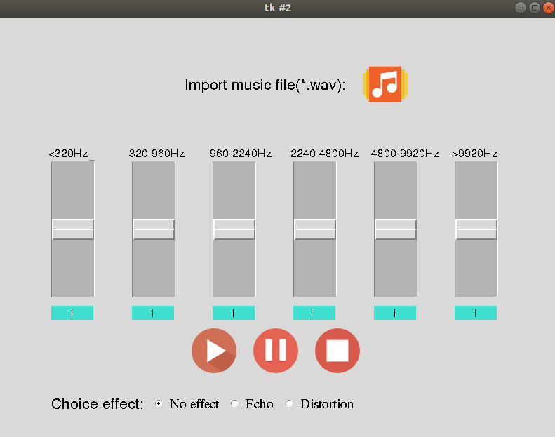

# Equalizer

Equalizer for wav-mono files on Python with effects (echo, distortion). 
Modeling of filters for different frequencies in Matlab and project transfer in Python with GUI (tkinter).

## Install

### 1. Activate virtual environment

'''
python -m venv venv
source venv/bin/activate
'''

### 2. Install packets

'''pip install -r requirements.txt'''

### 3. Now you can run the program with the following command.

'''python launch.py'''

